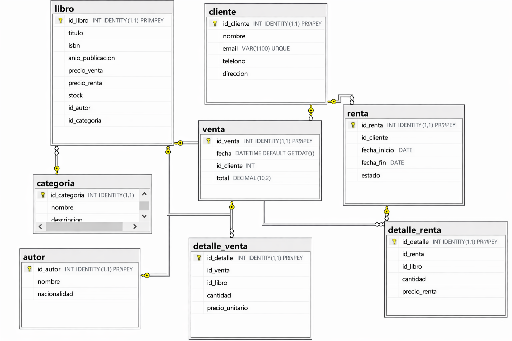

### Parte 2 – Contenido **obligatorio** del archivo README.md

El README **debe** contener **todos** estos apartados en este orden (personalizar el contenido entre corchetes con la información real del grupo). No es opcional ni sugerido; es requisito de evaluación.

```markdown
# BookFlow – Sistema Integral de Gestión de Libros
Plataforma digital para gestionar, vender y rentar libros en una sola aplicación.

[Una frase corta que resuma el propósito – máximo 15 palabras]

## Introducción / Contexto

En muchas librerías, bibliotecas pequeñas y negocios de alquiler de libros, la gestión de inventario, ventas y préstamos se realiza de forma manual o con herramientas poco integradas. Esto puede generar problemas como desorganización en el inventario, errores en el registro de ventas o dificultades para controlar las fechas de devolución de los libros rentados.

El proyecto BookFlow surge como una solución tecnológica que permite centralizar y automatizar estos procesos en una sola plataforma digital. Mediante el uso de una aplicación web, los administradores podrán gestionar el catálogo de libros, registrar clientes, controlar ventas y administrar rentas de manera eficiente.

La relevancia de este proyecto radica en su impacto tanto académico como empresarial. Desde el punto de vista académico, permite aplicar conocimientos de programación, bases de datos, control de versiones y arquitectura de software. Desde el punto de vista empresarial, puede servir como herramienta para mejorar la gestión de pequeñas librerías o negocios de renta de libros, optimizando el control de inventario y las transacciones con clientes.

El dominio del proyecto se enfoca en la gestión comercial y administrativa de libros, incluyendo el manejo del catálogo, clientes, ventas, rentas y control de disponibilidad de los ejemplares.

## Objetivos

Objetivo General

Desarrollar una plataforma web que permita gestionar, vender y rentar libros de forma organizada y eficiente.

Objetivos Específicos

- Diseñar una base de datos que permita almacenar información sobre libros, clientes, ventas y rentas.
- Implementar un sistema de gestión de inventario para controlar la disponibilidad de los libros.
- Desarrollar funcionalidades para registrar y administrar las ventas de libros.
- Implementar un módulo para la gestión de rentas de libros y control de devoluciones.
- Crear una interfaz web sencilla que permita interactuar con el sistema de manera clara y eficiente.

## Alcance del Proyecto (Scope)

Qué se va a desarrollar

- Sistema de gestión de libros (crear, consultar, editar y eliminar libros).
- Registro y gestión de clientes.
- Módulo de ventas de libros con registro de transacciones.
- Módulo de renta de libros con control de fechas de devolución.
- Control de inventario y disponibilidad de libros.
- Interfaz web para administración del sistema.
- Conexión con base de datos PostgreSQL.

Qué NO se va a desarrollar en esta versión
- Sistema de pagos en línea.
- Aplicación móvil para Android o iOS.
- Integración con sistemas externos de facturación electrónica.
- Sistema avanzado de reportes o analítica de datos.
- Gestión de envíos o logística de entrega.

## Tecnologías y Herramientas (Tech Stack)

- Frontend: Streamlit
- Backend: Python
- Base de datos: PostgreSQL
- Otras herramientas: Git, GitHub, Docker, Postman, Swagger

## Integrantes del Equipo

| Nombre                  | Rol principal              | Usuario GitHub     |
|-------------------------|----------------------------|--------------------|
| [Samuel]              | Líder / Backend            | @[usuario]         |
| [Santiago]              | Frontend Lead              | @[TheGhxstCO]         |
| [Juan Diego C.]              | Backend / Base de datos    | @[usuario]         |
| [Juan Diego L.]              | [QA / Documentaciónl]                      | @[usuario]         |
| ...                     | ...                        | ...                |

## Diagrama de Clases del Dominio (v1)

  

## Diagrama de la Base de Datos (Entidad-Relación)

A continuación se muestra el esquema de la base de datos utilizado en el proyecto:


(Coloca el archivo de imagen proporcionado en `docs/diagrama-bd.png` para que se visualice correctamente.)  
